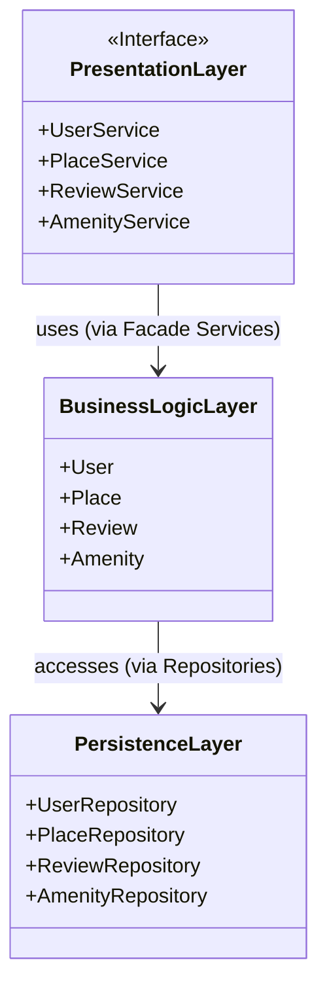

# High-Level Package Diagram - HBnB Architecture

---

## 📚 What’s inside each box (explained simply)

### 🟦 Presentation Layer

This is the **front desk** of the app. It talks to the user.

* When someone uses the app (register, create a place, etc...), this layer receives the request.
* Services like `UserService` or `PlaceService` act like helpers that **pass the request to the next layer**, and make sure everything is in order.

👉 exemple: it's like the entrence of an house

---

### 🟩 Business Logic Layer

This is the **brain** of the app. It decides **what needs to be done**.

* Here we have the main objects of the app: a `User`, a `Place`, a `Review`, or an `Amenity`.
* This layer checks if rules are respected. For example: “does this place have a price?”, “is the rating between 1 and 5?”, etc...

👉 exemple: it's like the hearth of the house (kitchen, saloon, etc...)

---

### 🟫 Persistence Layer

This is the **storage room**. It keeps everything saved.

* This layer talks directly to the database.
* The repositories (`UserRepository`, `PlaceRepository`, etc.) know **how to save**, **find**, and **delete** things.

👉 exemple: it's like the basement of the house (where you stocks datas)

---

## 🎭 What’s the “Facade Pattern”?

Instead of letting the front desk (the Presentation Layer) talk directly to the storage room (the database),
we use **a middleman** (the services) who knows how everything works.

* The services (like `UserService`) make sure the request is clean, valid, and complete.
* Then, they send it to the brain (business logic) and finally to the storage room.

👉 exemple: It’s like you ask the receptionist for something → the receptionist talks to the right department → the department sends the file to the storage team.

