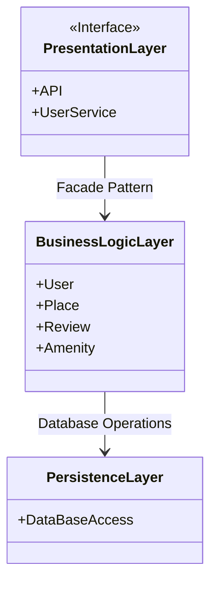

# High-Level Package Diagram - HBnB Architecture

---

## 📚 What’s contain the package diagram

### 🟦 Presentation Layer

This layer handles the interaction between the user and the application. It includes all the services and APIs that are exposed to the users.

👉 exemple: it's like the entrence of an house

---

### 🟩 Business Logic Layer

This layer contains the core business logic and the models that represent the entities in the system (e.g., User, Place, Review, Amenity).

👉 exemple: it's like the hearth of the house (kitchen, saloon, etc...)

---

### 🟫 Persistence Layer

This layer is responsible for data storage and retrieval, interacting directly with the database.

👉 exemple: it's like the basement of the house (where you stocks datas)

---

## 🎭 What’s the “Facade Pattern”?

A Facade Pattern is a design pattern that provides a simple interface to a complex subsystem. It helps hide the internal workings of a system and allows higher-level components (like APIs) to interact with services more easily and cleanly.

👉 exemple: It’s like you ask the receptionist for something → the receptionist talks to the right department → the department sends the file to the storage team.

