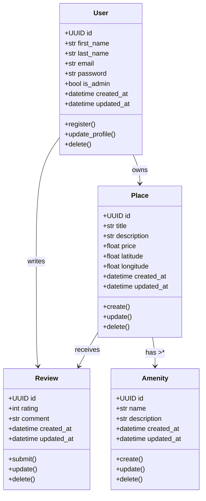

# Class Diagram – Business Logic Layer

## Business Logic Layer – Entities Description

### 👤 User
Represents a person using the platform.
Can be a regular user or an admin.
Handles account information and owns places and reviews.

### 🏠 Place
Represents a property listed by a user.
Includes details like title, description, price, and location.
Linked to its owner and associated with amenities and reviews.

### 📝 Review
Represents feedback left by a user about a place.
Contains a rating and a comment.
Linked to both a user (author) and a place (target).

### 🪑 Amenity
Represents a feature available in a place (e.g., WiFi, pool).
Can be associated with multiple places.
Used to describe and filter place offerings.
