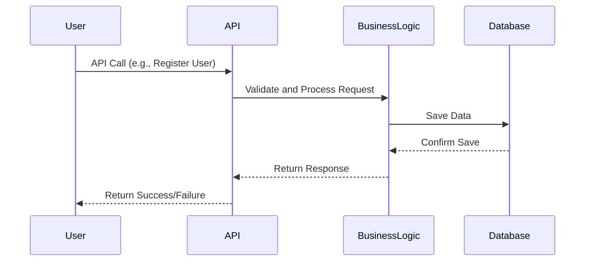

# 🧩 Sequence Diagram - User Registration

### 👤 User Registration – Sequence Description

This diagram illustrates the process when a user registers on the HBnB platform.
The API receives the user's data and delegates the operation to the `UserService`,
which validates the input and creates a new `User` object. The `UserRepository`
then persists the data to the database. A success or error response is returned to the client.
