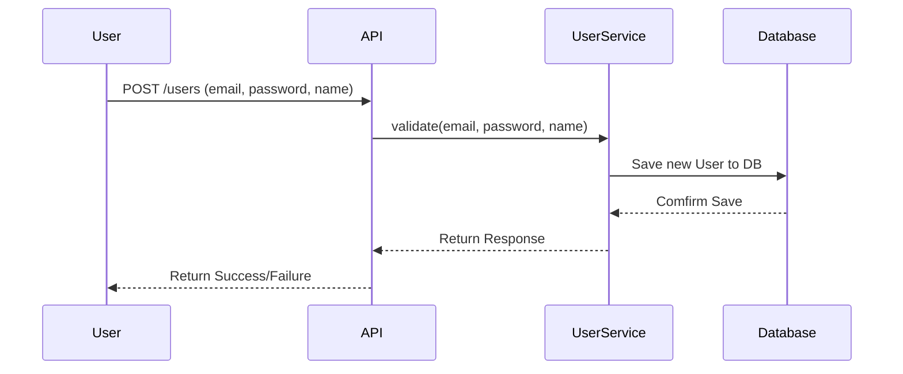
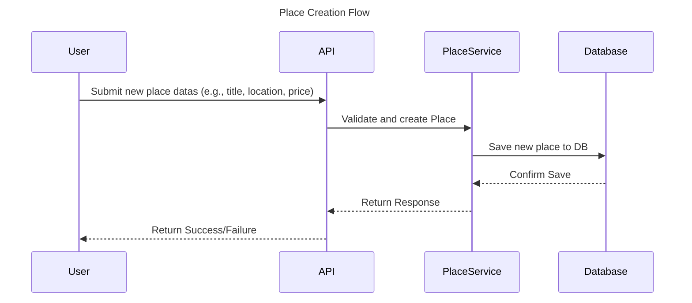
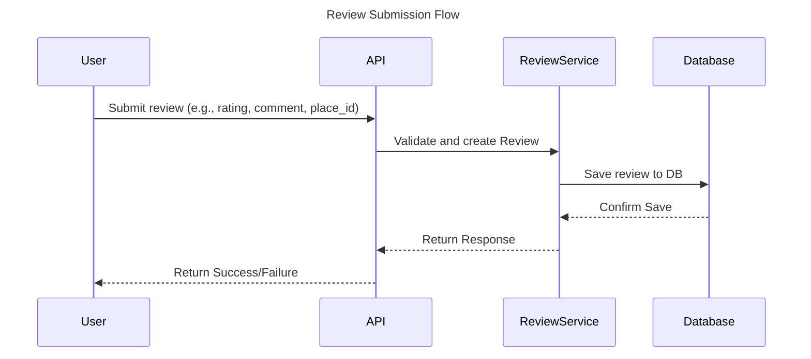
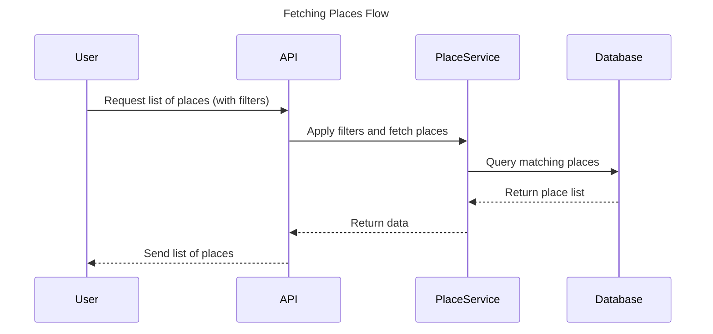

# 🧩 Sequence Diagram - User Registration

This sequence diagram shows how a new user is register in the HBnB application.
It demonstrates the flow of data through the API, service, and database layers.

---

### 👤 User Registration – Sequence Description

This diagram illustrates the process when a user registers on the HBnB platform.
The API receives the user's data and delegates the operation to the `UserService`,
which validates the input and creates a new `User` object. The `UserRepository`
then persists the data to the database. A success or error response is returned to the client.

# 🧩 Sequence Diagram – Place Creation

This sequence diagram shows how a new place is created in the HBnB application.
It demonstrates the flow of data through the API, service, and database layers.

---

# 🏠 Place Creation - Sequence Description

User sends place information like title, location, and price. The API forwards the request to the PlaceService. PlaceService checks the data and builds a new Place object. The Database saves the new place entry. A confirmation is sent back up through the layers. The User receives a message indicating if the place creation succeeded or failed.

# 🧩 Sequence Diagram – Review Submission

This sequence diagram explains how a user submits a review for a place in the HBnB platform.
It highlights the interaction between the user, API, service logic, and data storage.

---

# 📝 Review Creation - Sequence Description

User fills and submits a review form including comment and rating. The API captures the request and sends it to the ReviewService. ReviewService validates the input and builds a Review object. The Database stores the new review. A confirmation goes back up through the service and API. The User receives a success or error message.

# 🧩 Sequence Diagram – Fetching a List of Places

This sequence diagram shows how the HBnB system handles a request to fetch a filtered list of available places.
It outlines how the request travels through the API, is processed by the business logic, and retrieves data from the database.

---

# 📝 Fetching a List of Places - Sequence Description

User sends a request to retrieve places, possibly with filters (e.g., location, price, amenities). The API layer receives and forwards the request to the PlaceService. PlaceService applies the filters and queries the Database. The Database returns the list of places that match the criteria. The list is passed back through the Service and API layers. The User receives the final filtered list of places.
