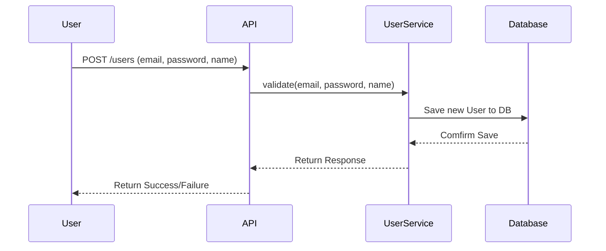
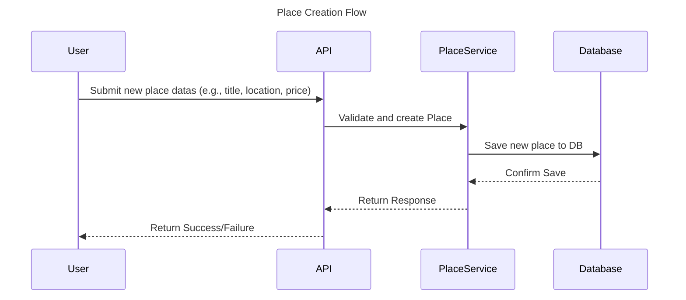

# 🧩 Sequence Diagram - User Registration

This sequence diagram shows how a new user is register in the HBnB application.
It demonstrates the flow of data through the API, service, and database layers.

---

### 👤 User Registration – Sequence Description

This diagram illustrates the process when a user registers on the HBnB platform.
The API receives the user's data and delegates the operation to the `UserService`,
which validates the input and creates a new `User` object. The `UserRepository`
then persists the data to the database. A success or error response is returned to the client.

# 🧩 Sequence Diagram – Place Creation

This sequence diagram shows how a new place is created in the HBnB application.
It demonstrates the flow of data through the API, service, and database layers.

---

# 🏠 Place Creation - Sequence Description

User sends place information like title, location, and price. The API forwards the request to the PlaceService. PlaceService checks the data and builds a new Place object. The Database saves the new place entry. A confirmation is sent back up through the layers. The User receives a message indicating if the place creation succeeded or failed.

